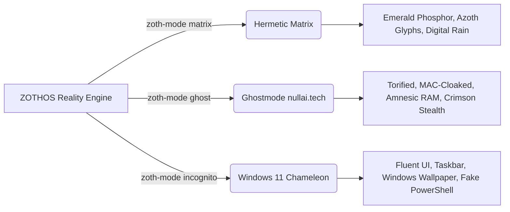

# 🜂 ZOTHOS Linux 🜄
### *The Alchemical Intelligence & Security Operating System*
> *"As above, so below; as code, so mind."*

```text
       ▲             ZOTHOS Linux 1.0 (Azoth Transmutation)
      ▲ ▲            --------------------------------------
     ▲   ▲           OS Reality:       Hermetic Matrix [Emerald Phosphor]
    ▲  ☉  ▲          Kernel:           Linux 6.x (Debian 13 Trixie / Parrot 7)
   ▲   |   ▲         Desktop:          XFCE 4.18 + Picom (Matrix Glassmorphism)
  ▲ 🜂  ☿  🜄 ▲        Security Stack:   Kali Linux + Parrot OS Dual Repos
 ▲             ▲       Frontier AI:      Ollama + ComfyUI + Hermes + Garak + PyRIT
▲═══════🜁═══════▲      Stealth Engine:   nullai.tech Ghostmode [Amnesic Tor]
  \   🜃     /        Undercover Guise: Windows 11 Fluent Chameleon
   \   |   /         Zoth Studio:      v3.2 Sovereign Cockpit Pre-installed
    \  🝘  /          Architecture:     x86_64 Hybrid UEFI/BIOS ISO
     \   /
      ▼
```

---

## ✦ System Manifesto & Vision

**ZOTHOS** is a custom Linux distribution engineered at the convergence of three paradigms:
1. **Hermetic Philosophy meets The Matrix**: Obsidian voids, emerald phosphor terminals, sacred geometry, alchemical glyphs (`☉ ☽ ☿ ♀ ♂ ♃ ♄ 🜂 🜄 🜁 🜃`), and digital rain.
2. **Ghostmode (nullai.tech influence)**: Military-grade amnesic operational security, automatic MAC-address randomization, multi-hop Tor transparent routing, hostname scrambling, and ephemeral RAM cache scrubbing.
3. **Incognito Mode (Windows 11 Camouflage)**: Sub-second desktop transformation into a Windows 11 Enterprise environment (taskbar layout, Fluent GTK theme, Segoe styling, fake PowerShell prompt, decoy icons) for high-stakes physical operational security in corporate spaces.
4. **Security Tool Parity**: Complete offensive & defensive tool parity with **Kali Linux** and **Parrot Security OS** via smart Debian APT pinning.
5. **Frontier & Underground AI Forge**: Pre-loaded mainstream local inference (Ollama, vLLM, llama.cpp, ComfyUI) plus underground red-teaming harnesses (Garak, PyRIT, Promptfoo, inspect_ai), multi-agent orchestrators (Hermes Agent, Antigravity SDK, CrewAI, LangGraph, AutoGen), and automated browser agents.
6. **Zoth Studio**: Out-of-the-box first-class integration with the Zoth Studio hub, Simplex quantum-resistant comms bridge, BYOK Argon2id Keymaster Vault, and biomorphic memory matrix.

---

## ✦ The Three Realities (Modes)

ZOTHOS allows instant switching between three completely distinct environments with no logout or reboot required:



| Mode | Command | Key Features | Visual Aesthetic |
| :--- | :--- | :--- | :--- |
| **Hermetic Matrix** | `zoth-mode matrix` | Default reality, alchemical glyphs, fastfetch status, full tool access | Emerald `#00ff9d` on Obsidian `#050807`, Glass borders |
| **Ghostmode** | `zoth-mode ghost` | Transparent Tor, MAC address scrambling, hostname randomization, memory drop caches, disabled history | Pure black `#000000`, dimmed slate `#94a3b8`, crimson accents |
| **Incognito** | `zoth-mode incognito` | Windows 11 bottom taskbar, Fluent styling, Windows Bloom wallpaper, fake PowerShell terminal profile | Windows Fluent acrylic dark/light, `#0078d4` blue |

---

## ✦ Curated Arsenal & Architecture

### 1. Security Tools (Kali Linux & Parrot OS Parity)
Accessed via CLI launcher: `zoth-sec`
- **Reconnaissance & OSINT**: Nmap, Masscan, Amass, Nuclei, Sublist3r, theHarvester, Recon-ng, DNSRecon, Maltego.
- **Web Application Auditing**: SQLMap, Nikto, WPScan, GoBuster, FFUF, Feroxbuster, Commix, Testssl.sh, Burp Suite, OWASP ZAP.
- **Exploitation Frameworks**: Metasploit Framework, Searchsploit, BeEF-XSS, Sliver, CrackMapExec / NetExec.
- **Wireless & RF Warfare**: Aircrack-ng suite, Airgeddon, Kismet, Wifite, Reaver, Bully, GQRX, HackRF.
- **Password & Hash Cracking**: Hashcat, John the Ripper, Hydra, Medusa, Crunch, Ophcrack, SecLists, RockYou.
- **Reverse Engineering**: Ghidra, Radare2, Cutter, Binwalk, GDB (GEF/pwndbg), Checksec.
- **Sniffing & MITM**: Wireshark, Tshark, Bettercap, Mitmproxy, Responder, Impacket suite.
- **Forensics & Incident Response**: Volatility 3, Autopsy, SleuthKit, Lynis, Chkrootkit, Rkhunter.

### 2. Mainstream AI Stack
Accessed via CLI launcher: `zoth-ai`
- **Local Inference Engines**: Ollama, vLLM, llama.cpp server, ExLlamaV2.
- **User Interfaces**: Open WebUI (port 8080), ComfyUI (port 8188), Automatic1111 / SD-Forge.
- **Voice & Speech**: Faster-Whisper, Kokoro TTS, Piper TTS.
- **Model Management**: Hugging Face CLI (`hf_transfer`), bitsandbytes, PEFT, Unsloth, Axolotl.

### 3. Underground & Frontier AI Harnesses
- **Red-Teaming & Vulnerability Scanners**:
  - `garak`: Generative AI vulnerability scanner (prompt injection, hallucinations, data exfiltration).
  - `pyrit`: Microsoft Python Risk Identification Tool for AI red teaming.
  - `promptfoo`: Automated LLM security testing & jailbreak harness.
  - `lm-evaluation-harness`: EleutherAI standard benchmarking (MMLU, GSM8k, ARC).
  - `inspect_ai`: Frontier AI safety and evaluation platform.
- **Agent Orchestrators & Automation**:
  - `hermes`: Hermes Agent autonomous runner & skill bus.
  - `google-antigravity`: AGY SDK multi-agent orchestration.
  - `crewai`: Role-playing autonomous agent swarms.
  - `langgraph`: Stateful directed-graph AI agent workflows.
  - `autogen`: Multi-agent conversational frameworks.
  - `browser-use`: Autonomous browser-driving agent with vision.
  - `open-interpreter`: Local code execution loop.
  - `crawl4ai`: High-speed async web crawler tailored for LLMs.
  - `caido`: Next-generation intercepting proxy for web and API security.

### 4. Zoth Studio Integration
- Built-in command: `zoth`
- Pre-installed at `/opt/zoth-studio/` with interactive TUI, SimpleX E2EE bridge, BYOK Argon2id Keymaster Vault, and biomorphic memory matrix.

---

## ✦ Repository Layout

```text
/home/neo/zothos/
├── README.md                               # This master documentation
├── build/
│   ├── build-iso.sh                        # Master Debian live-build ISO compiler
│   └── docker/
│       └── Dockerfile.builder              # Containerized ISO builder
├── config/
│   └── includes.chroot/                    # Root filesystem overlay for live image
│       ├── etc/
│       │   ├── apt/
│       │   │   ├── preferences.d/
│       │   │   │   └── zothos-pinning.pref # Smart multi-repo Debian/Kali/Parrot pinning
│       │   │   └── sources.list.d/
│       │   │       ├── kali.list           # Kali Rolling tool repo
│       │   │       ├── parrot.list         # Parrot Security repo
│       │   │       └── zothos.list         # ZOTHOS custom repo
│       │   └── skel/                       # Default skeleton user profile
│       │       ├── .bashrc                 # Custom prompt, aliases & fastfetch auto-run
│       │       ├── .zshrc
│       │       └── Desktop/                # Pre-populated desktop shortcuts
│       ├── opt/
│       │   └── zoth-studio/                # Bundled Zoth Studio application & UI
│       └── usr/
│           ├── local/bin/                  # Master ZOTHOS CLI scripts
│           │   ├── zoth                    # Zoth Studio sovereign CLI
│           │   ├── zoth-ai                 # AI Command Center & Orchestrators
│           │   ├── zoth-fastfetch          # Emerald Tablet system info display
│           │   ├── zoth-ghost              # nullai.tech anti-forensics daemon
│           │   ├── zoth-matrix-rain        # Alchemical matrix screensaver
│           │   ├── zoth-mode               # Reality Switcher (matrix/ghost/incognito)
│           │   ├── zoth-quicklock          # Panic lock & RAM cache scrubber
│           │   ├── zoth-sec                # Security tools launcher
│           │   └── zoth-undercover         # Windows 11 camouflage switcher
│           └── share/
│               ├── backgrounds/zothos/     # High-res generated wallpapers
│               │   ├── ghostmode-nullai.png
│               │   ├── hermetic-matrix.png
│               │   └── win11-bloom.jpg
│               └── themes/                 # Custom GTK3 themes
│                   ├── Zoth-Ghost-NullAI/
│                   ├── Zoth-Hermetic-Matrix/
│                   └── Zoth-Incognito-Win11/
├── installer/
│   └── calamares/branding/zothos/          # Graphical disk installer branding
├── package-lists/
│   ├── zothos-core.list.chroot             # Kernel, XFCE4, Picom, drivers
│   └── zothos-security-kali-parrot.list.chroot # Full security toolchain
└── tools/
    ├── convert-local-to-zothos.sh          # Instantly converts current host into ZOTHOS!
    ├── generate-wallpapers.py              # Procedural wallpaper engine
    ├── setup-zoth-ai-stack.sh              # One-command installer for all AI tools
    └── test-zothos.sh                      # QEMU virtual machine test script
```

---

## ✦ How to Build the Bootable ISO

### Native Build (Debian/Parrot/Ubuntu host):
```bash
cd /home/neo/zothos
sudo bash build/build-iso.sh
```
The script will install `live-build`, bootstrap Debian 13 (Trixie), overlay the ZOTHOS packages, themes, and configurations, and produce:
`build/zothos-1.0-amd64.iso`

### Docker Containerized Build:
```bash
cd /home/neo/zothos
docker build -t zothos-builder -f build/docker/Dockerfile.builder .
docker run --privileged -v $(pwd):/workspace zothos-builder
```

### Test in QEMU:
```bash
./tools/test-zothos.sh build/zothos-1.0-amd64.iso
```

---

## ✦ Instant Local Conversion (Run on Current Host)

If you are already running Debian, Parrot OS, or Ubuntu and want to transform your existing desktop into ZOTHOS immediately:

```bash
cd /home/neo/zothos
bash tools/convert-local-to-zothos.sh
```

Now try:
- `matrix` or `zoth-mode matrix`
- `ghost` or `zoth-mode ghost`
- `win11` or `zoth-mode incognito`
- `zoth-ai`
- `zoth-sec`
- `zoth-fastfetch`
- `zoth-matrix-rain`
