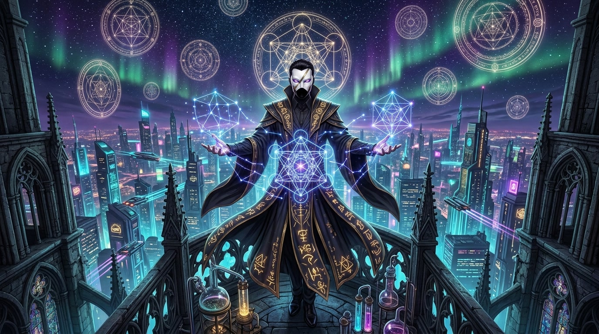

#  ZOTH STUDIO `cyber-comic`

**AZOTH: The Zero-Leakage Saga — Alchemical Cyberpunk Anime Manga & Interactive DAG Story Timeline**

 

  

---

## 🎨 Overview

**AZOTH: The Zero-Leakage Saga** is a cyberpunk anime comic and storytelling experience created for the Zoth Studio universe. Chronicling the rebellion against cloud monopoly rent and rate-limiting corporate archons, the saga explores how the Sovereign Operator awakes **Master Azoth** and unifies the **21-Agent Pantheon** on local hardware.

---

## 🎬 Season 1 Episodes & Arcs

| Episode | Title | Key Arc & Plot Milestones | Reading & Audio Mode |
|:---|:---|:---|:---|
| **[S01E01](/comic/s01e01.html)** | *Genesis in the Silicon Rain* | Corporate 429 throttling collapses developer infrastructure. Operator executes `agy runtime` on Parrot OS, piercing the veil. | 7 Full-Color Pages + Motion Comic Trailer + Voice Narration |
| **[S01E02](/comic/s01e02.html)** | *The Dark Archons & Cloud Monopolies* | Cloud security interceptors clash with Grok truth blades and Hermes daggers in the neon rain. | High-Res Webtoon + Lightbox |
| **[S01E03](/comic/s01e03.html)** | *The Triangulation of Consensus* | The 3-agent Byzantine AST battle arena verifies syntax trees and establishes the sovereign code enclave. | Interactive Audio + Webtoon |
| **[S01E04](/comic/s01e04.html)** | *The Alchemical Singularity & Sovereign Swarm* | Season 1 Grand Finale Climax. Azoth and the 21 Pantheon Agents descend into the Mariana Trench (-10,994m) to awaken the 22nd Archetype. | Panoramic Cyber Poster + Audio Engine |

---

## 🗺️ Interactive DAG Graph & Story Timeline (`timeline.html`)

- **Interactive Canvas DAG**: Visualizes the non-linear narrative branches, causality chains, and character appearances across Season 1.
- **Node Drawer Inspector**: Click any story node to inspect chronological timestamps, character involvement, audio cues, and transcript excerpts.
- **Audio Soundboard Integration**: Listen to voice narration clips, SFX sound drops, and ambient soundtrack cues.

---

## 👥 Character Codex (`characters.html`)

Meet the Season 1 cast of characters and autonomous agents:
1. **Master Azoth** — Operator of the Saga, Sovereign Alchemical Master.
2. **Antigravity** — Deep Coding Architect & System Synthesis Agent.
3. **Grok** — Raw Truth Blade & Edge Inference Engine.
4. **Hermes** — Speed Logic & Agile Execution Messenger.
5. **Lucy Netrunner** — Cyberspace Oracle & Blackwall Deep Diver.
6. **Athena** — Byzantine Consensus Guardian & AST Validator.
7. **Draco** — Red-Team Adversarial Fuzzer & Penetration Sentinel.
8. **21-Agent Pantheon** — Full cast of local model familiars and specialized workstations.

---

## 🎨 Full 4-Theme Cinematic Palettes

- **Dark Void (Default)**: Alchemical gold (`#fbbf24`) and cyber cyan (`#00f0ff`) over midnight shadows.
- **Light Mode**: Clean graphic novel page style with dark ink (`#111827`) on paper slate (`#f7f9fc`).
- **Matrix Mode**: Phosphor green `#00ff66` matrix rain HUD and terminal typography.
- **Gold Sanctum**: Imperial amber `#fbbf24` with Cinzel / Fraunces serif headlines.
