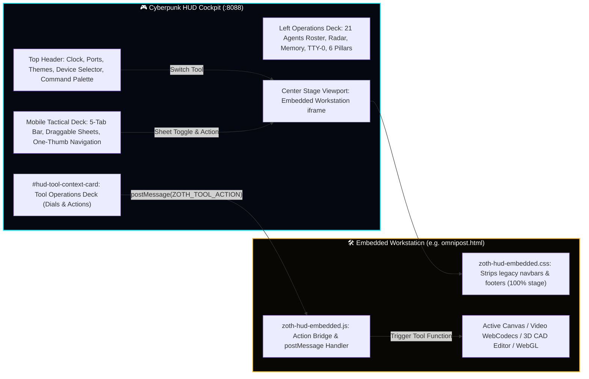

<div align="center">

#  🌌 ZOTH STUDIO: CORE APP & WORKSTATION SUITE (v5.6.0)
### *Sovereign Local-First AI Multi-Agent Workstation Suite, Cyberpunk HUD & Autonomous Web Foundry*

[](https://github.com/NullAITech/zoth-studio)
[-fbbf24?style=for-the-badge&logo=probot&logoColor=black)](public/docs/hermes-agent.md)
[](../LICENSE)
[](http://127.0.0.1:8088/)
[](http://127.0.0.1:8088/agents/)
[-00f0ff?style=for-the-badge&logo=electron&logoColor=white)](http://127.0.0.1:8088/studio/cyberpunk-hud.html)
[-f472b6?style=for-the-badge&logo=rust&logoColor=white)](http://127.0.0.1:8088/vault/)
[-10b981?style=for-the-badge&logo=brainz&logoColor=white)](http://127.0.0.1:8088/memory/)

<br>

<p align="center">
  
</p>

<!-- Live Animated Telemetry HUD -->
<p align="center">
  
</p>

<p align="center">
  <strong><a href="http://127.0.0.1:8088/studio/cyberpunk-hud.html">🎮 Launch Cyberpunk HUD</a></strong> •
  <strong><a href="http://127.0.0.1:8088/docs/readmes.html">📚 Interactive README Library</a></strong> •
  <strong><a href="http://127.0.0.1:8088/studio/omnipost.html">🎬 OmniPost Video Studio</a></strong> •
  <strong><a href="http://127.0.0.1:8088/studio/nexus-3d.html">🪐 Nexus 3D Studio</a></strong> •
  <strong><a href="http://127.0.0.1:8088/studio/swarm.html">⚡ Swarm Arena</a></strong> •
  <strong><a href="http://127.0.0.1:8088/memory/">🧠 STDP Memory</a></strong> •
  <strong><a href="http://127.0.0.1:8088/docs/">📖 Docs Hub</a></strong>
</p>

</div>

<p align="center"></p>

## 🛡️ Core App Overview & Scope

`core-app` is the primary frontend workstation suite, CLI execution cockpit, and Unix PTY harness for **Zoth Studio**. It provides 28+ zero-cloud, client-side web workstations serving the entire 21-agent Pantheon, WebGen autonomous code synthesis, real-time 3D spatial monitoring, the **AI Math Pillars Theory Academy**, the **12-Formula #つぶやきProcessing Topology Lab**, and the **Cyberpunk Video Game HUD Cockpit**.

### Directory Structure & Subsystems:
- **`bin/zoth`**: High-performance Python 3 CLI & Curses TUI symlinked globally to `~/.local/bin/zoth`.
- **`public/studio/`**: 28+ static web workstations, CAD viewports, video studio, consensus crucible, and sandboxes.
- **`public/assets/`**:
  - `zoth-cyberpunk-hud.js` & `zoth-cyberpunk-hud.css`: Master tactical video game HUD engine with multi-device responsive profiles, mobile bottom sheets, toast notifications, keyboard shortcuts matrix, and procedural Web Audio synthesizer.
  - `zoth-hud-palette.js` & `zoth-hud-palette.css`: High-speed keyboard Command Palette (`Ctrl+K`) indexing 298+ tools, 21 agents, 9 workstations, and 4 themes.
  - `zoth-hud-embedded.js` & `zoth-hud-embedded.css`: Universal embedded workspace adapter and bi-directional action bridge (`postMessage`).
  - `zoth-theme.css`: 4-Theme master engine (`dark`, `light`, `matrix`, `gold`) with WCAG AA contrast, CRT scanlines, and 60 aesthetic presets.
- **`public/docs/`**: Comprehensive markdown architectural manuals, theory proofs, and agent guides rendered dynamically via `public/docs/readmes.html`.
- **`tools/`**: Local Unix PTY engine (`pty.fork`), DuckyScript compiler, and loopback agent orchestrator (`:8484`).

---

## 🎮 Cyberpunk HUD Cockpit & Embedded Workstation Engine

The Cyberpunk HUD creates an immersive, high-speed tactical desktop and mobile operations environment:



### Key Capabilities:
1. **Zero-Root Scroll Cockpit**: 100vh desktop layout with chamfered sci-fi borders, scanning LEDs, and animated holographic atmosphere.
2. **Multi-Device Responsive Architecture**: Dynamic layout switching across **Desktop (>=1200px)**, **Tablet (768px-1199px)**, and **Phone (<=768px)** with draggable bottom sheets and touch target hardening.
3. **360° Polar Radar Sweep**: Tracks 21 swarm agents across 4 celestial quadrants with click-to-attune agent selection and sweep pings.
4. **Real-Time Audio Scope**: 60 FPS Web Audio oscilloscope featuring Waveform, FFT Spectrum, and XY Lissajous modes.
5. **Dual-Tool Split Stage**: Side-by-side split screen (`[ ◫ SPLIT ]` or `Shift+S`) for simultaneous editing and previewing.
6. **Tool-Specific Operations Deck**: Dynamically reskins when any tool loads, presenting quick dials tailored to that workstation.
7. **Sensory Toggles & Tactical FX**:
   - **Kiroshi POV Visor Mode (`Shift+K`)**: HUD optical zoom and targeting telemetry reticle.
   - **Sandevistan Overdrive (`Shift+X`)**: 10-second boosted frame pacing with chromatic aberration.
   - **Neural Load Vitals**: Dynamic calculation of system load based on active daemons and canvas render state.
   - **Procedural Cyber Audio Synthesizer**: Web Audio oscillator feedback with instant mute persistence (`Shift+M`).
8. **Command Palette (`Ctrl+K` / `Cmd+K`)**: Instant fuzzy search across 298+ tools, 21 agents, 9 workstations, and 4 themes.

---

## 🕊️ Hermes Agent CLI & Terminal REPL Integration

The HUD TTY-0 Terminal REPL connects directly to **Nous Research Hermes Agent (v0.21.2)** and the multi-agent consensus bus:

| Command | Action & Telemetry Output |
|:---|:---|
| `hermes status` | Inspects Hermes v0.21.2 engine, active `azoth-prime` profile, and loaded skills (270+). |
| `hermes doctor` | Runs complete diagnostics on tool availability, SQLite state DB, and memory daemon. |
| `hermes <task>` | Dispatches autonomous subagent tasks with real-time feedback in the HUD message stream. |
| `debate <topic>` | Runs simulated multi-agent dialectic consensus debate between Athena, Draco, Azoth, and Hermes. |
| `swarm <query>` | Dispatches query across all 21 swarm agents and synthesizes consensus findings. |
| `split` / `split swap` | Toggles and swaps dual-tool split stage mode between two workstations. |
| `radar ping` / `radar zoom` | Broadcasts sweep ping to all 21 swarm agents and scales radar range. |
| `scope wave` / `scope fft` | Toggles real-time audio oscilloscope between waveform and frequency FFT modes. |
| `pillars` | Computes live values across all 6 mathematical calculus pillars. |
| `theme <name>` | Switches 4-theme engine (`dark`, `light`, `matrix`, `gold`). |
| `device <mode>` | Forces device layout mode (`desktop`, `tablet`, `mobile`, `auto`). |

> [!NOTE]
> Pressing **`Tab`** in the HUD Terminal REPL activates smart auto-completion across all commands.

---

## 🛠️ Complete Workstation Inventory (`public/studio/`)

Zoth Studio features **28+ specialized, zero-cloud workstations** accessible both standalone and embedded in the Cyberpunk HUD:

<div align="center">

| Workstation | Direct URL | Runtime | Primary Function |
|:---|:---|:---:|:---|
| **Cyberpunk HUD Cockpit** | [`/studio/cyberpunk-hud.html`](http://127.0.0.1:8088/studio/cyberpunk-hud.html) | `HTML5 / JS / CSS` | Flagship 2-column video game cockpit, split stage, radar, and REPL |
| **OmniPost 2.0 Sovereign Social** | [`/studio/omnipost.html`](http://127.0.0.1:8088/studio/omnipost.html) | `WebCodecs / Canvas` | 60 FPS video creator, multi-platform preview cards, AI tone shifter |
| **Nexus 3D Studio & CAD** | [`/studio/nexus-3d.html`](http://127.0.0.1:8088/studio/nexus-3d.html) | `Three.js / WebGL` | Procedural shader materials, GLTF/USDZ exporter, turnaround recorder |
| **3D CAD Editor** | [`/studio/3d-editor.html`](http://127.0.0.1:8088/studio/3d-editor.html) | `Three.js / WebGL` | CAD-grade 3D viewport, mesh deformer, wireframe inspection |
| **Swarm Command Arena** | [`/studio/swarm.html`](http://127.0.0.1:8088/studio/swarm.html) | `WebGL 2D/3D` | 21-Agent kinetic spatial swarm flocking & laser triangulation |
| **Consensus Crucible v2** | [`/studio/consensus.html`](http://127.0.0.1:8088/studio/consensus.html) | `Wasm / AST Parser` | 3-Model dialectic arbitration with Shannon entropy ($H < 0.20$ bits) |
| **AI Math Pillars Academy** | [`/studio/math-pillars.html`](http://127.0.0.1:8088/studio/math-pillars.html) | `KaTeX / Canvas` | 6 Sacred Mathematical Pillars interactive visual proofs |
| **Netrunner Memory Studio** | [`/studio/netrunner-memory.html`](http://127.0.0.1:8088/studio/netrunner-memory.html) | `Canvas / SSE / REST` | Biomorphic STDP synaptic graph, Lucy (:8788) sync, Obsidian export |
| **Memory Whitespace Hub** | [`/memory/`](http://127.0.0.1:8088/memory/) | `HTML5 / JS` | Human narrative digests + AI full-spectrum telemetry inspector |
| **WebGen Autonomous Site Foundry** | [`/studio/webgen.html`](http://127.0.0.1:8088/studio/webgen.html) | `Vite / Astro / JS` | Full-stack autonomous site synthesizer, live preview, and ZIP exporter |
| **Tool Nexus Explorer** | [`/studio/tool-nexus.html`](http://127.0.0.1:8088/studio/tool-nexus.html) | `JSON / JS` | Searchable catalog of 298+ tools with JSON-Schema contract validation |
| **Tool Bench & Harness** | [`/studio/tool-bench.html`](http://127.0.0.1:8088/studio/tool-bench.html) | `HTML5 / JS` | Uniform execution harness for local tools with simulated/live execution |
| **Peer Bus & Swarm Bridge** | [`/studio/peer-bus.html`](http://127.0.0.1:8088/studio/peer-bus.html) | `SSE / WebSockets` | Multi-agent file bus coordination, live event stream, broadcast dispatch |
| **Connectors & Loopback Bridge** | [`/studio/connectors.html`](http://127.0.0.1:8088/studio/connectors.html) | `REST / Fetch` | Integration hub for local daemons (:8788, :8787, :8765, :8767, :11434) |
| **Bus Monitor** | [`/studio/bus-monitor.html`](http://127.0.0.1:8088/studio/bus-monitor.html) | `Canvas / JS` | Real-time message throughput, latency waterfall, and packet telemetry |
| **Edge Function Forge** | [`/studio/edge-forge.html`](http://127.0.0.1:8088/studio/edge-forge.html) | `Monaco / JS` | Serverless V8 isolate editor, rate limiters, Solana RPC connectors |
| **SubSweep Reconnaissance** | [`/studio/subsweep.html`](http://127.0.0.1:8088/studio/subsweep.html) | `Node.js / JS` | OSINT attack surface scanner, CT log probe, and TLS cryptographic auditor |
| **Vision Link Spatial HUD** | [`/studio/vision-link.html`](http://127.0.0.1:8088/studio/vision-link.html) | `Webcam / MediaPipe` | Hand gesture tracking, 3D overlays, touchless ROI pinch-zooming |
| **AI Model Foundry** | [`/studio/models.html`](http://127.0.0.1:8088/studio/models.html) | `REST / Ollama` | Local model benchmark arena with latency waterfall & prompt testing |
| **Visual DAG Agent Composer** | [`/studio/agent-composer.html`](http://127.0.0.1:8088/studio/agent-composer.html) | `SVG / Canvas` | Node graph editor with bezier connecting wires and playbook exporter |
| **IDE / Code Workbench** | [`/studio/ide.html`](http://127.0.0.1:8088/studio/ide.html) | `Monaco / PTY` | In-browser code editing with local filesystem access and syntax highlighting |
| **Notes Reviewer & Codex** | [`/studio/notes-reviewer.html`](http://127.0.0.1:8088/studio/notes-reviewer.html) | `Markdown / AST` | Structured research review, wikilink parsing, and Obsidian synchronization |
| **VOS Virtual Sandbox** | [`/studio/vos-sandbox.html`](http://127.0.0.1:8088/studio/vos-sandbox.html) | `Wasm / x86` | In-browser virtualized Unix execution sandbox and memory scratchpad |
| **Keymaster Argon2id Vault** | [`/vault/`](http://127.0.0.1:8088/vault/) | `Rust / Argon2id` | Zero-leak hardware key store encrypted with Argon2id + XChaCha20-Poly1305 |
| **Adytum Zero-Trust Sanctum** | [`/adytum/`](http://127.0.0.1:8088/adytum/) | `Crypto API` | Cryptographic secret verification, hardware attestation, and signing |
| **Pet Dex & Sanctuary** | [`/pets/studio.html`](http://127.0.0.1:8088/pets/studio.html) | `Three.js / Audio` | 24 alchemical companion spirits, voxel shaders, and summoning rituals |
| **Pet Companion Hangar** | [`/pets/`](http://127.0.0.1:8088/pets/) | `CSS3D / Canvas` | Interactive pet habitat, telemetry stats, and sprite animation viewer |
| **Signal & SimpleX Comms** | [`/signal/`](http://127.0.0.1:8088/signal/) | `SSE / WebSockets` | Sovereign end-to-end encrypted messaging bridge with tagged memory ledgers |

</div>

---

## 🧪 Verification & Automated Testing

The Core App includes an automated **28-suite test harness** verifying all HUD visualizers, adapters, sensory engines, and agent bridges:

```bash
# Execute the comprehensive 28-suite HUD verification test harness
node public/assets/zoth-cyberpunk-hud.test.js
```

```text
⚡ Running Cyberpunk HUD Tactical Visualizers Verification Tests...

✔ Test 1 Passed: zoth-cyberpunk-hud.js exists (350228 bytes)
✔ Test 2 Passed: Master HUD Controller API initialized and tactical methods exposed
✔ Test 3 Passed: Real-Time Audio Oscilloscope operates across wave, fft, and lissajous modes
✔ Test 4 Passed: 360° Polar Radar Sweep Mini-Map tracks all 21 swarm agents correctly
✔ Test 5 Passed: Complete 6-Pillar Mathematical Calculus telemetry verified
✔ Test 6 Passed: Interactive Memory Graph node clicking & consolidation waves verified
✔ Test 7 Passed: Dynamic Stage Tool Loader & Stage History verified
✔ Test 8 Passed: Dual-Tool Split Stage Mode verified
✔ Test 9 Passed: Active Agents Selector switches across 21 agents with voice feedback
✔ Test 10 Passed: 4-Theme Engine cycles between dark, light, matrix, and gold
✔ Test 11 Passed: Modals (ports, pillars, toolmgr) and live logging operational
✔ Test 12 Passed: Omniverse Navigator & Tool Router open/close and filter verified
✔ Test 13 Passed: URL State Synchronization & backwards-compatible aliases verified
✔ Test 14 Passed: Universal Embedded Workspace Adapters & Navbar/Footer Cleaner verified
✔ Test 15 Passed: Tool-Specific HUD Context Card & 10 Workstation Profiles verified
✔ Test 16 Passed: Bi-Directional Action Bridge & Event Dispatch verified
✔ Test 17 Passed: Hermes Agent Integration, Dispatch & REPL Autocomplete verified
✔ Test 18 Passed: Grok Intelligence Layer, Dashboard Mode, Auto-Acclimation & Self-Healing Watchdog verified
✔ Test 19 Passed: Multi-Device Responsive Cockpit Engine (Desktop, Tablet, Phone) verified
✔ Test 20 Passed: Tablet Tactical Bar, Mobile Bottom Sheets & Audio Mute Controller verified
✔ Test 21 Passed: Tool Dropdown Quick-Switcher & 21-Agent Dynamic Left Deck Roster verified
✔ Test 22 Passed: Dashboard Surface Toggle & Bottom Dock Navigation verified
✔ Test 23 Passed: CyberAudioSynth Sound Generator, Waveforms & Mute Persistence verified
✔ Test 24 Passed: Kiroshi POV Visor Mode, Sandevistan Overdrive & Neural Load Vitals verified
✔ Test 25 Passed: Video Game Keyboard Shortcuts, High-Contrast WCAG AAA Mode, Theater Stage & A11y Live Announcer verified
✔ Test 26 Passed: Procedural Web Audio API Synthesizer (5 sound types, aliases, mute persistence) verified
✔ Test 27 Passed: POV Cockpit Vitals Engine, Multi-Factor Neural Load, Sandevistan 10s Cooldown & Kiroshi Zoom verified
✔ Test 28 Passed: Comprehensive 25+ Workstations Mounting, Dashboard Mode Toggle & Overlap Prevention verified

⭐ ALL 28 CYBERPUNK HUD TACTICAL VISUALIZERS, WORKSTATION MOUNTING, BREATHING ROOM, HERMES, GROK & POV VITALS TESTS PASSED (100%)!
```

---

## 📜 Documentation Guides & Markdown Library

All guides are rendered interactively in-browser via the **[Interactive README Library](http://127.0.0.1:8088/docs/readmes.html)**:

- 🎮 **[Cyberpunk HUD Cockpit Manual](public/docs/hud.md)** — Multi-device responsive design, keyboard matrix, audio oscilloscope, and terminal REPL.
- 🛠️ **[Workstations Catalog](public/docs/workstations.md)** — Comprehensive breakdown of all 28+ sovereign workstations with inputs and actions.
- 🎨 **[4-Theme Master System Spec](public/docs/themes.md)** — WCAG AA color tokens, CRT scanlines, and contrast rules.
- 💬 **[Signal & SimpleX Sovereign Comms](public/docs/messaging.md)** — Tagged thread memory, router architecture, and CLI commands.
- 📖 **[Operator User Guide](public/docs/USER_GUIDE.md)** — Port matrix, keyboard shortcuts, memory CLI runbook, and math academy.
- 🕊️ **[Hermes Agent Architecture Guide](public/docs/hermes-agent.md)** — Nous Hermes integration, subagent delegation, and skills ecosystem.
- 🏛️ **[Home & Sanctum Architecture](public/docs/home-sanctum.md)** — Sovereign local-first privacy doctrine and hub composition.
- 🧠 **[Biomorphic Memory & CLS Theory](public/docs/architecture.md)** — STDP synaptic plasticity, hippocampal replay, and Lucy Oracle.
- 🎨 **[Brand & Visual Identity Spec](public/brand/README.md)** — Color palettes, SVG seals, and typographic hierarchy.
