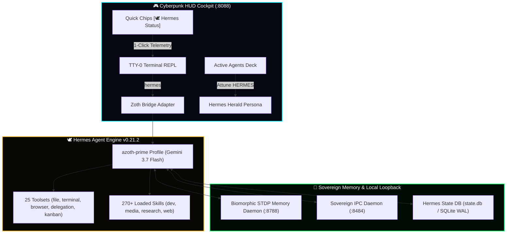
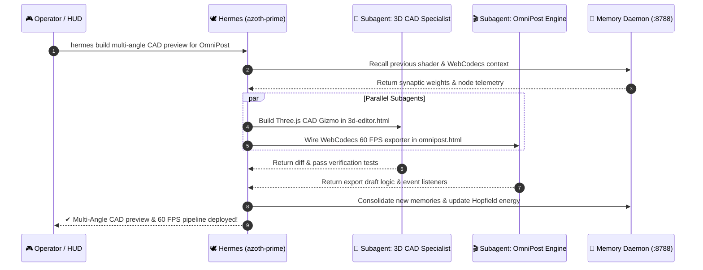

# 🕊️ Hermes Agent & Autonomous Subagent Engine (v0.21.2)
### *Nous Research Hermes Agent Integration, Sovereign Profiles & HUD REPL Execution*

> [!IMPORTANT]
> **Zero Telemetry & Strict Sovereignty**: Zoth Studio couples its multi-agent intelligence layer directly to the **Nous Research Hermes Agent (v0.21.2)** framework. All execution, tool-calling, and synaptic memory indexing run on local loopback with zero telemetry egress.

---

## ⚡ 1. Overview & Architecture

**Hermes Agent** is an open-source autonomous agent framework by Nous Research that runs natively in your terminal, IDEs, and messaging gateways. Within **Zoth Studio**, Hermes acts as the herald and execution engine, powering autonomous subagent swarms, tool dispatching, and bi-directional workstation coordination.



---

## 🏛️ 2. Core Capabilities & Profile Specification

| Feature | Specification Details |
|:---|:---|
| **Framework Engine** | **Hermes Agent v0.21.2** (Nous Research) |
| **Active Profile** | `azoth-prime` (`~/.hermes/profiles/azoth-prime/`) |
| **Backing Model** | `gemini-3.7-flash` (via Nous Research / Google AI) |
| **Loaded Skills** | **270+ Procedural Skills** (`.agents/skills/` and `~/.hermes/skills/`) |
| **Active Toolsets** | **25 Toolsets**: `file`, `terminal`, `browser`, `code_execution`, `delegation`, `memory`, `kanban`, `vision`, `tts` |
| **Memory Engine** | Canonical SQLite + FTS5 (`~/.hermes/state.db`) + Zoth Memory Daemon (`http://127.0.0.1:8788`) |
| **CLI Execution** | `/home/neo/.local/bin/hermes` |
| **Security Mode** | Automated secret redaction, non-destructive sandboxing, strict POSIX execution |

---

## ⌨️ 3. Cyberpunk HUD Terminal Commands

The HUD TTY-0 Terminal REPL provides dedicated commands for inspecting and driving Hermes:

```bash
# Display Hermes engine diagnostics, profile info, and loaded skills
hermes status

# Run doctor self-check on tools and environment
hermes doctor

# Dispatch an autonomous subagent task
hermes build a real-time WebCodecs video pipeline for OmniPost

# Trigger memory sync with the Zoth daemon
hermes memory sync
```

### Auto-Completion & Command Chips
- **Tab Auto-Completion**: Typing `her` and pressing `Tab` autocompletes to `hermes`.
- **Quick Chip**: Clicking `[🕊 Hermes Status]` directly above the prompt executes an instant health probe.

---

## 🐾 4. Subagent Delegation Workflow

When executing complex multi-file engineering tasks, Hermes uses `delegate_task` to spawn isolated background subagents:



---

## 🛡️ 5. Integration Verification

You can verify Hermes Agent integration locally at any time:

```bash
# 1. Check Hermes version & profile
hermes --version
hermes profile list

# 2. Run test query
hermes -p azoth-prime chat -q "Status report for Zoth Studio"

# 3. Run full HUD & Hermes unit test suite (17/17 passing)
node core-app/public/assets/zoth-cyberpunk-hud.test.js
```
