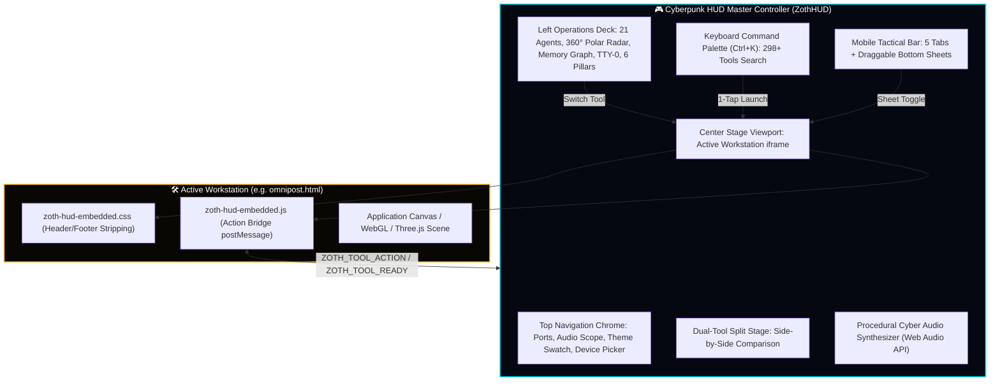

# 🎮 Cyberpunk HUD Cockpit — Master Technical Manual (v5.6.0)

The **Zoth Cyberpunk HUD** is the sovereign command cockpit wrapping all **298+ verified tools**, **28+ specialized workstations**, and **21 autonomous AI agents** into an adaptive, video-game-grade operational cockpit tailored for **Desktop Workstations**, **Touch Tablets**, and **Mobile Smartphones**.

- **Launch URL**: [http://127.0.0.1:8088/studio/cyberpunk-hud.html](/studio/cyberpunk-hud.html) (or [`/studio/cockpit.html`](/studio/cockpit.html))
- **Core Engine**: [`public/assets/zoth-cyberpunk-hud.js`](file:///media/neo/f2fdda77-178b-4603-ae80-c7aa4cd97908/zoth-studio/core-app/public/assets/zoth-cyberpunk-hud.js) (350KB)
- **Styles**: [`public/assets/zoth-cyberpunk-hud.css`](file:///media/neo/f2fdda77-178b-4603-ae80-c7aa4cd97908/zoth-studio/core-app/public/assets/zoth-cyberpunk-hud.css)
- **Test Harness**: [`public/assets/zoth-cyberpunk-hud.test.js`](file:///media/neo/f2fdda77-178b-4603-ae80-c7aa4cd97908/zoth-studio/core-app/public/assets/zoth-cyberpunk-hud.test.js) (28 Test Suites, 100% Passing)

---

## 🏛️ System Architecture



---

## 📱 1. Multi-Device Responsive Profiles

The HUD dynamically inspects window dimensions and hardware touch support to seamlessly adapt its layout across three distinct profiles:

### 🖥️ A. Desktop Cockpit (Widescreen >= 1200px)
- **Zero-Root Scroll Cockpit**: 100vh locked screen with chamfered sci-fi borders, animated scanning LEDs, and holographic atmosphere.
- **Left Operations Deck**: 360° Polar radar sweep, STDP synaptic memory graph, TTY-0 Sovereign Terminal, and 6-Pillar calculus meters.
- **Real-Time Header Audio Oscilloscope**: 60 FPS Web Audio oscilloscope displaying Waveform, FFT Spectrum, and Lissajous Phase Orbital modes.
- **Dual-Tool Split Stage (`Shift+S`)**: Loads two tools concurrently side-by-side with independent control dials and postMessage dispatch.

### 📱 B. Tablet Tactical Cockpit (768px – 1199px)
- **Stage-First Maximization**: 100% full stage focus with zero horizontal overflow.
- **Segmented Tablet Tactical Bar**: Touch-friendly floating bar (`🎯 STAGE`, `📊 TELEMETRY`, `🔮 SWARM`, `⚡ REPL`, `🧠 MEMORY`, `📐 PILLARS`).
- **Collapsible Floating Drawer**: 380px slide-out deck with backdrop blur and edge-swipe support.

### 📲 C. Phone Tactical Deck (<= 768px)
- **One-Thumb Mobile Experience**: Edge-to-edge full viewport stage with keyboard-safe `100dvh` unit scaling.
- **Compact Sticky Top Bar (48px)**: Active tool dropdown, theme toggle, audio SFX button, and tool search.
- **5-Button Tactical Bottom Tab Bar (56px)**:
  1. `🎯 Stage` — Focuses the active workstation canvas.
  2. `🛠️ Tools` — Slides up the searchable 298+ tool drawer with 1-tap loading.
  3. `🔮 Swarm` — Slides up the 21-Agent fleet attunement sheet with domain tags.
  4. `⚡ REPL` — Slides up the mobile Sovereign Terminal with quick chips and touch input.
  5. `📊 Telemetry` — Slides up the live polar radar, memory stats, and 6-pillar calculus meters.
- **Draggable Mobile Sheets**: Smooth drag handle, scan-line reveal animations, and backdrop tap-to-dismiss.

---

## 👁️ 2. Sensory Toggles & Tactical Video Game FX

### Kiroshi POV Visor Mode (`Shift+K`)
- Simulates an in-universe cybernetic ocular zoom overlay.
- Magnifies the active stage canvas with an animated holographic HUD reticle, target crosshairs, and live coordinate telemetry.

### Sandevistan Overdrive (`Shift+X`)
- Triggers a 10-second boosted frame pacing state.
- Adds chromatic aberration edge fringing, high-speed audio sweep chirps, and dynamic time dilation overlays.
- Features an automated 10-second cooldown timer displayed in the telemetry bar.

### Neural Load Vitals Engine
- Dynamically computes system vital capacity (0% to 100%) based on:
  - Active background loopback daemons (:8788, :8787, :8765, :8767).
  - Canvas render complexity and frame rate.
  - Number of active memory nodes in the working buffer.

### Procedural Cyber Audio Synthesizer
- Built-in Web Audio API oscillator bank generating 5 procedural audio feedback types:
  - `CLICK`: Subtle high-frequency chirp for button taps.
  - `CHIME`: Harmonic two-tone chord for theme switching and mode shifts.
  - `SWEEP`: Low-to-high frequency sweep for radar pings and tool loads.
  - `WARP`: Pitch-descending slide for Sandevistan activation.
  - `ALERT`: Staccato pulse for error states and memory warnings.
- Autoplay-safe with persistent mute state in `localStorage` (`Shift+M`).

---

## ⚡ 3. Multi-Agent REPL Debate Simulator

The TTY-0 Terminal REPL connects to local agents and includes a simulated multi-agent dialectic consensus crucible:

| Terminal Command | Action & Output |
|:---|:---|
| `debate <topic>` | Initiates a structured multi-agent debate between **Athena** (AST logic), **Draco** (adversarial critique), **Azoth** (alchemical synthesis), and **Hermes** (pragmatic execution) with animated typewriter logs and a final consensus card. |
| `swarm <query>` | Broadcasts `<query>` across all 21 agents and prints a categorized response summary. |
| `synthesize <topic>` | Pulls active memory clusters from Lucy (:8788) and generates an executive consensus dossier. |
| `hermes <task>` | Dispatches task to Nous Research Hermes Agent CLI with live step-by-step progress. |
| `split` / `split swap` | Toggles or swaps side-by-side split screen between primary and secondary tools. |
| `theme <name>` | Switches theme to `dark`, `matrix`, `gold`, or `light`. |
| `device <mode>` | Forces device layout (`desktop`, `tablet`, `mobile`, `auto`). |

---

## ⌨️ 4. Master Keyboard Shortcuts Matrix

| Key Combo | Action |
|:---|:---|
| <kbd>1</kbd> – <kbd>9</kbd> | Instant 1-click stage switch across 9 flagship workstations |
| <kbd>Shift</kbd> + <kbd>T</kbd> | Cycle 4 Master Themes (Dark, Matrix CRT, Hermetic Gold, Solar Light) |
| <kbd>Shift</kbd> + <kbd>V</kbd> | Open Device Profile Selector Modal |
| <kbd>Shift</kbd> + <kbd>M</kbd> or <kbd>M</kbd> | Toggle Cyber Audio Sound FX (Mute / Unmute) |
| <kbd>Shift</kbd> + <kbd>S</kbd> | Toggle Dual-Tool Split Stage Mode |
| <kbd>Shift</kbd> + <kbd>D</kbd> | Toggle Left Telemetry Operations Deck Drawer |
| <kbd>Shift</kbd> + <kbd>R</kbd> | Broadcast 360° Polar Radar Sweep Ping to All 21 Agents |
| <kbd>Shift</kbd> + <kbd>O</kbd> | Cycle Real-Time Audio Oscilloscope (Waveform / FFT / Lissajous) |
| <kbd>Shift</kbd> + <kbd>K</kbd> | Toggle Kiroshi POV Visor Optical Zoom Overlay |
| <kbd>Shift</kbd> + <kbd>X</kbd> | Trigger Sandevistan Overdrive (10s Speed Burst & Cooldown) |
| <kbd>Shift</kbd> + <kbd>A</kbd> | Toggle High-Contrast WCAG AAA Accessibility Mode |
| <kbd>Ctrl</kbd> + <kbd>K</kbd> / <kbd>Cmd</kbd> + <kbd>K</kbd> | Open Master Tool Manager & Command Palette (Search 298+ Tools) |
| <kbd>`</kbd> or <kbd>Esc</kbd> | Focus Terminal REPL / Dismiss Active Modal or Sheet |
| <kbd>Alt</kbd> + <kbd>◀</kbd> / <kbd>▶</kbd> | Navigate Stage Tool History (Back / Forward) |
| <kbd>F11</kbd> | Toggle Fullscreen Cockpit Viewport |

---

## 🧪 5. Automated 28-Suite Test Verification

Run the automated test harness from the `core-app/` directory:

```bash
node public/assets/zoth-cyberpunk-hud.test.js
```

All 28 verification suites execute in `< 100ms`, verifying:
1. `zoth-cyberpunk-hud.js` integrity and file size (350KB+).
2. API exposure of `window.ZothHUD` methods.
3. Audio oscilloscope rendering modes.
4. Polar radar 21-agent coordinate mapping.
5. 6-Pillar mathematical calculus calculations.
6. STDP synaptic memory graph interactions.
7. Stage tool loader and history stack.
8. Dual-tool split stage iframe rendering.
9. 21-Agent selector and audio voice chimes.
10. 4-Theme cycling and CSS token application.
11. Modals (ports, pillars, toolmgr, shortcuts).
12. Omniverse navigator and category filters.
13. URL state synchronization (`?tool=...`, `?theme=...`).
14. Embedded workspace adapters (`zoth-hud-embedded.css`).
15. Tool-specific context cards and dial profiles.
16. Bi-directional `postMessage` action bridge.
17. Hermes Agent CLI dispatch and autocompletion.
18. Grok intelligence layer and self-healing watchdog.
19. Multi-device responsive engine (Desktop, Tablet, Mobile).
20. Tablet tactical bar and draggable mobile sheets.
21. Tool dropdown quick-switcher.
22. Dashboard surface toggle and bottom dock.
23. Cyber audio synthesizer and mute persistence.
24. Kiroshi POV visor mode and neural load vitals.
25. High-contrast WCAG AAA mode and A11y announcer.
26. Procedural Web Audio synthesizer waveforms.
27. Sandevistan overdrive 10-second cooldown timer.
28. 25+ Workstations mounting and overlap prevention.
