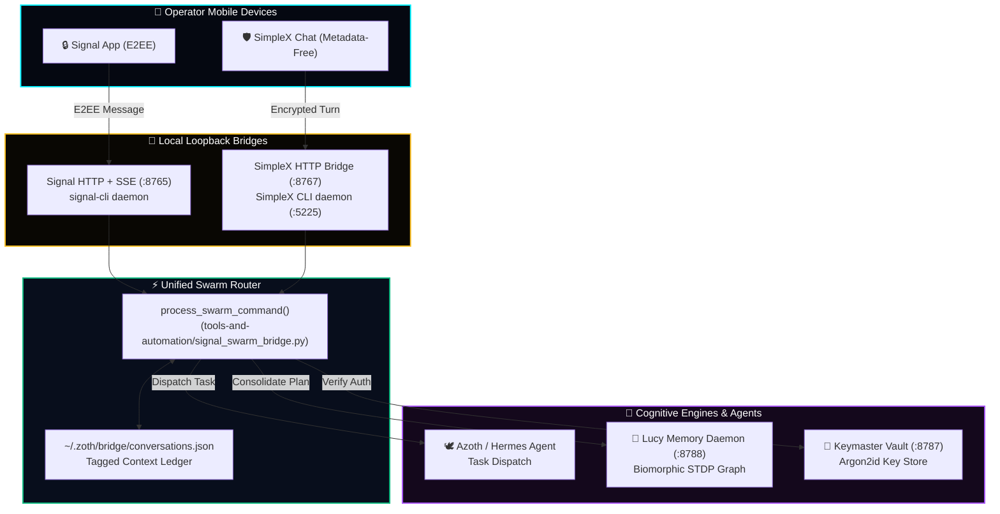

# 💬 Signal & SimpleX Sovereign Communications Manual

Zoth Studio features an air-gapped, zero-cloud sovereign messaging bridge allowing operators to command 21 autonomous AI agents directly from mobile chat applications using **Signal** and **SimpleX Chat**.

Both protocols interface with a unified, deterministic command router and tagged conversational memory ledger stored strictly on your local disk.

---

## 🏛️ System Architecture



---

## 🔌 Loopback Network Ports

| Port | Service | Status | Protocol | Function |
|:---|:---|:---:|:---|:---|
| **`:8765`** | **Signal HTTP + SSE Bridge** | Private | HTTP / SSE | Handles inbound/outbound Signal messages via `signal-cli`. |
| **`:8767`** | **SimpleX Web Bridge** | Private | HTTP REST | Connects to SimpleX CLI daemon and routes commands. |
| **`:5225`** | **SimpleX Core Daemon** | Private | IPC / TCP | Local isolated SimpleX chat node with zero user identifiers. |
| **`:8788`** | **Lucy Memory Daemon** | Private | HTTP REST | Synchronizes multi-turn plans and STDP synaptic clusters. |
| **`:8787`** | **Keymaster Vault Daemon** | Zero-Leak | HTTP RPC | Authenticates signed commands and unlocks private keys. |

---

## 📜 Tagged Conversation Memory Schema

Every inbound and outbound message across Signal and SimpleX is automatically classified and appended to the local ledger at `~/.zoth/bridge/conversations.json`.

```json
{
  "sender_id": "+15550199482",
  "messages": [
    {
      "id": "m142",
      "timestamp": "2026-09-17T14:22:05Z",
      "sender": "operator",
      "text": "/plan Refactor WebGen component architecture to use Astro islands",
      "kind": "plan",
      "tags": ["plan", "webgen", "astro", "agent:azoth"],
      "related": ["m140", "m141"]
    },
    {
      "id": "m143",
      "timestamp": "2026-09-17T14:22:08Z",
      "sender": "azoth",
      "text": "Plan formulated across 4 steps. Step 1: Extract UI cards into standalone .astro primitives.",
      "kind": "response",
      "tags": ["step:1", "plan:active", "agent:azoth"],
      "related": ["m142"]
    }
  ],
  "active_plan_id": "m142"
}
```

### Contextual Follow-Up Clustering
When an operator replies with a concise follow-up like `"proceed with step 2"`, the router:
1. Identifies the active plan ID from the sender's ledger.
2. Pulls the relevant message cluster (`related: [...]`).
3. Injects the plan context into an **`[ACTIVE PLAN]`** prompt block.
4. Dispatches to the target agent without requiring the operator to repeat the entire prompt.

---

## ⚡ Master Slash Commands

Operators can execute tactical studio commands directly within chat conversations:

| Command | Action & Response |
|:---|:---|
| `/plan <brief>` | Generates a multi-step execution plan and pins it as the active conversation goal. |
| `/status` | Returns system telemetry: active loopback daemons, memory nodes, and running tasks. |
| `/thread` | Displays the current conversation cluster that will be injected into agent context. |
| `/tags` | Lists all indexed semantic tags and associated message IDs for this sender. |
| `/recall <topic>` | Queries the full ledger and retrieves all historical turns discussing `<topic>`. |
| `/agent <name>` | Explicitly routes subsequent turns to a specific agent (`azoth`, `hermes`, `athena`, `draco`). |
| `/vault status` | Checks Keymaster Vault seal state without exposing sensitive keys. |
| `/new` or `/reset` | Wipes the current sender's active ledger and starts a fresh conversation cluster. |

---

## 🧠 Lucy Cognitive Memory Consolidation

When the Lucy Memory Daemon is active on `:8788`:
- Completed plans and key decisions are automatically encoded into the **Biomorphic STDP Graph**.
- High-salience conversational insights are weighted with synaptic strengths ($\Delta w = A_+ e^{-\Delta t/\tau_+}$).
- Future queries in the Web Workstations (like Netrunner Memory or Swarm Arena) can recall and expand upon plans initiated over mobile chat.
