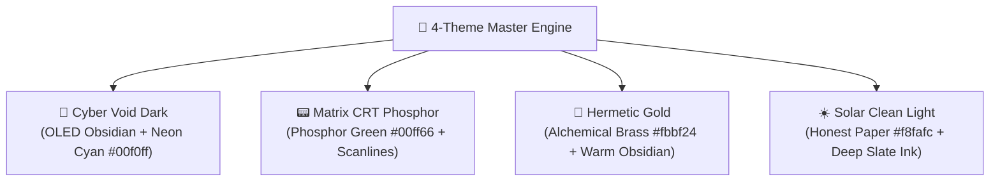

# 🎨 Zoth Studio 4-Theme Master System & Design Tokens

Zoth Studio features an integrated **4-Theme Master Design System** engineered for tactical legibility, high visual contrast, and zero eye fatigue. The studio guarantees **WCAG AA / AAA contrast** across all 28+ workstations and both desktop and mobile viewports.

---

## 🏛️ The 4 Core Sovereign Themes

Every workstation, HUD component, card, and modal dynamically transitions across four core themes:



### 1. 🌙 Cyber Void Dark (`dark`) — Default
- **Aesthetic**: Deep obsidian slate OLED cockpit with glowing neon cyan accents and subtle glassmorphism.
- **Backgrounds**: `--hud-bg-base: #050811`, `--hud-bg-card: rgba(8, 14, 28, 0.85)`
- **Accents**: `--hud-cyan: #00f0ff`, `--hud-border: rgba(0, 240, 255, 0.25)`
- **Typography**: High-contrast white headers (`#f8fafc`) with muted slate secondary labels (`#94a3b8`).
- **Atmosphere**: Cyber grid floor, subtle radial vignette, and translucent backdrop blurs (`backdrop-filter: blur(16px)`).

### 2. 📟 Matrix CRT Phosphor (`matrix`)
- **Aesthetic**: Authentic retro hacker terminal inspired by vintage P31 green monochrome phosphor cathode-ray tube monitors.
- **Backgrounds**: `--hud-bg-base: #020a04`, `--hud-bg-card: rgba(3, 18, 8, 0.90)`
- **Accents**: `--hud-green: #00ff66`, `--hud-border: rgba(0, 255, 102, 0.30)`
- **Atmosphere**: Active CSS CRT scanline overlays (`background: repeating-linear-gradient(...)`), subtle phosphor bloom, and high-contrast green monospaced typography.

### 3. 👑 Hermetic Gold (`gold`)
- **Aesthetic**: Alchemical brass, warm amber, and golden parchment set against obsidian stone.
- **Backgrounds**: `--hud-bg-base: #090703`, `--hud-bg-card: rgba(22, 16, 7, 0.90)`
- **Accents**: `--hud-gold: #fbbf24`, `--hud-border-gold: rgba(251, 191, 36, 0.35)`
- **Atmosphere**: Warm amber lighting, celestial brass divider rules, and burnished metallic borders.

### 4. ☀️ Solar Clean Light (`light`) — Honest Paper
- **Aesthetic**: Purpose-built, high-contrast daylight mode modeled after editorial technical journals.
- **Backgrounds**: `--hud-bg-base: #f8fafc`, `--hud-bg-card: #ffffff`
- **Accents**: Clean royal cobalt (`#0071e3`), refined borders (`#cbd5e1`), and soft neutral box shadows.
- **Typography**: Deep slate ink (`#0f172a`) with dark charcoal body text (`#334155`).
- **Honest Paper Invariant**: `light` is **never an inverted dark filter** or washed-out gray mess. It strictly sets `color-scheme: light` with razor-sharp black ink on crisp white paper for effortless reading in direct sunlight.

---

## 🎛️ Design Tokens & CSS Custom Properties

All workstations inherit the unified tokens defined in [`public/assets/zoth-theme.css`](file:///media/neo/f2fdda77-178b-4603-ae80-c7aa4cd97908/zoth-studio/core-app/public/assets/zoth-theme.css) and `zoth-cyberpunk-hud.css`:

```css
:root {
  /* Master Fonts */
  --hud-font-sans: 'Figtree', -apple-system, BlinkMacSystemFont, sans-serif;
  --hud-font-mono: 'IBM Plex Mono', monospace;
  --hud-font-hud: 'Syne', sans-serif;

  /* Universal Core Colors */
  --hud-cyan: #00f0ff;
  --hud-gold: #fbbf24;
  --hud-green: #00ff66;
  --hud-red: #ff3366;
  --hud-purple: #a855f7;

  /* 6-Pillar Calculus Colors */
  --hud-pillar-1: #00f0ff; /* Linear Algebra & SVD */
  --hud-pillar-2: #38bdf8; /* Information Geometry */
  --hud-pillar-3: #10b981; /* STDP Synaptic Plasticity */
  --hud-pillar-4: #fbbf24; /* Shannon Agreement Entropy */
  --hud-pillar-5: #f43f5e; /* Kolmogorov-Arnold Networks */
  --hud-pillar-6: #a855f7; /* Continuous Hopfield Energy */

  /* Default Dark Tokens */
  --hud-bg-base: #050811;
  --hud-bg-card: rgba(8, 14, 28, 0.85);
  --hud-border: rgba(0, 240, 255, 0.22);
  --hud-border-subtle: rgba(255, 255, 255, 0.08);
  --hud-text-primary: #f8fafc;
  --hud-text-muted: #94a3b8;
}

/* Light Theme Overrides */
html[data-theme="light"] {
  color-scheme: light;
  --hud-bg-base: #f8fafc;
  --hud-bg-card: #ffffff;
  --hud-border: #cbd5e1;
  --hud-border-subtle: #e2e8f0;
  --hud-text-primary: #0f172a;
  --hud-text-muted: #64748b;
  --hud-cyan: #0071e3;
  --hud-gold: #b45309;
}
```

---

## 🎨 Sixty Curated Aesthetic Presets

Beyond the 4 sovereign master themes, Zoth Studio includes **60 fine-tuned aesthetic presets** for specialized creative environments:

1. **Studio Originals (24)**:
   Dark Void, Solar Light, Matrix CRT, Hermetic Gold, Dusk Rose, Abyssal Ocean, Forge Ember, Newsprint, Navy Signal, Amethyst Void, Moss Sanctum, Copper Patina, Alpine Snow, Vellum Champagne, Crimson Ledger, Jade Circuit, Indigo Chapel, Coral Dusk, Ivory Gallery, India Ink, Twilight Orchid, Iron Rust, Pearl Lilac, Graphite Lead.

2. **Frontier AI & Cloud (19)**:
   Anthropic, OpenAI, xAI, Google, Microsoft, Apple, AWS, Meta, NVIDIA, Hugging Face, Mistral, Vercel, DeepSeek, Perplexity, Cursor, Groq, Cohere, Stripe, Cloudflare.

3. **Developer & IDE Standards (17)**:
   Dracula, Nord, Synthwave '84, Solana, Monokai, Tokyo Night, Catppuccin, Gruvbox, Solarized, One Dark, GitHub Dark, Rosé Pine, Everforest, Ayu, Night Owl, Oxocarbon, Flexoki.

---

## ⌨️ How to Cycle and Set Themes

| Method | Interaction | Action |
|:---|:---|:---|
| **Keyboard Shortcut** | Press <kbd>Shift</kbd> + <kbd>T</kbd> | Cycles through the 4 master themes (`dark` → `matrix` → `gold` → `light`) with audio feedback chime. |
| **Header Swatch Picker** | Click `[ 🎨 THEME ▾ ]` | Opens the theme palette modal with live color swatches. |
| **Command Palette** | Press <kbd>Ctrl</kbd> + <kbd>K</kbd>, type `theme` | Instant 1-tap theme activation with fuzzy search. |
| **Terminal REPL** | Enter `theme matrix` or `theme gold` | Switches theme instantly and prints verification telemetry. |
| **URL Parameter** | Append `?theme=gold` to URL | Deep-links directly into a specific theme. |
| **JavaScript API** | `ZothHUD.setTheme('matrix')` | Programmatic switching with automatic `localStorage` synchronization. |

---

## ♿ Contrast & Accessibility Standards

- **WCAG AA Conformance**: All text elements maintain a minimum contrast ratio of **4.5:1** against backgrounds; large headlines maintain **3:1**.
- **High-Contrast AAA Mode**: Pressing `Shift+A` activates ultra-contrast mode, boosting borders to solid lines, maximizing opacity, and disabling motion blur.
- **Focus Rings**: Keyboard navigation highlights interactive components with a 2px glowing cyan outline (`outline: 2px solid var(--hud-cyan)`).
- **Reduced Motion**: Respects `prefers-reduced-motion: reduce` by disabling ambient particle sweeps, radar sweep rotation, and CRT jitter.
