# 🛠️ Zoth Studio Workstations Manual

The Zoth Studio catalog features **28+ zero-cloud, client-side workstations** designed for sovereign local-first AI agent development, 3D spatial engineering, autonomous media synthesis, and cryptographic security.

Every workstation runs as a standalone web application or mounts seamlessly into the **[Cyberpunk HUD Cockpit](hud.md)** stage via `?tool=<id>` with automatic navbar/footer stripping (`zoth-hud-embedded.css`) and bi-directional event bridging (`zoth-hud-embedded.js`).

Registry source: [`public/assets/zoth-hud-workstations.js`](file:///media/neo/f2fdda77-178b-4603-ae80-c7aa4cd97908/zoth-studio/core-app/public/assets/zoth-hud-workstations.js)

---

## 🧭 Workstations Taxonomy & Quick Reference

```mermaid
graph TD
    ZOTH["🌌 Zoth Studio Workstations (28+)"]
    ZOTH --> CREATIVE["🎬 Media & Autonomous Creation"]
    ZOTH --> SPATIAL["🪐 3D CAD & Spatial Computing"]
    ZOTH --> SWARM["⚡ Swarms, Consensus & Memory"]
    ZOTH --> OBSERVABILITY["📐 Observability & Math Theory"]
    ZOTH --> DEVELOPER["🛠️ Developer Tools & Sandboxes"]
    ZOTH --> SECURITY["🛡️ Cryptographic Security & Comms"]

    CREATIVE --> OMNIPOST["OmniPost 2.0 Video"]
    CREATIVE --> WEBGEN["WebGen Site Foundry"]
    CREATIVE --> VOS["VOS Virtual Sandbox"]

    SPATIAL --> NEXUS3D["Nexus 3D Studio"]
    SPATIAL --> CAD["3D CAD Mesh Deformer"]
    SPATIAL --> VISION["Vision Link Spatial HUD"]
    SPATIAL --> PETS["Pet Dex & Sanctuary 3D"]

    SWARM --> SWARMARENA["Swarm Command Arena"]
    SWARM --> CON["Consensus Crucible v2"]
    SWARM --> MEM["Netrunner Memory Studio"]
    SWARM --> PEER["Peer Bus & Swarm Bridge"]

    OBSERVABILITY --> PILLARS["AI Math Pillars Academy"]
    OBSERVABILITY --> BUSMON["Bus Monitor Telemetry"]
    OBSERVABILITY --> MODELS["AI Model Foundry"]

    DEVELOPER --> NEXUS["Tool Nexus (298+ Tools)"]
    DEVELOPER --> BENCH["Tool Bench & Harness"]
    DEVELOPER --> EDGE["Edge Function Forge"]
    DEVELOPER --> SUBSWEEP["SubSweep Reconnaissance"]
    DEVELOPER --> IDE["IDE / Code Workbench"]

    SECURITY --> VAULT["Keymaster Argon2id Vault"]
    SECURITY --> ADYTUM["Adytum Zero-Trust Sanctum"]
    SECURITY --> SIGNAL["Signal & SimpleX Comms"]
```



---

## 🎬 1. Media, Content & Autonomous Web Creation

### `omnipost` — OmniPost 2.0 Sovereign Social & Video Engine
- **Path**: [`/studio/omnipost.html`](http://127.0.0.1:8088/studio/omnipost.html)
- **Runtime**: `WebCodecs / Canvas 2D / Web Speech API`
- **Capabilities**:
  - 60 FPS client-side video composition and kinetic typography generation.
  - Multi-platform live preview cards: **X/Twitter** (280-char thread split), **Warpcast** (Cast view), **Bluesky** (300-char Skeet view), **LinkedIn** (Carousel presentation), and **Signal Swarm** (Encrypted broadcast).
  - AI Tone-Shifter: One-click dynamic rewriting in *Azoth Alchemical*, *Hermes Pragmatic*, *Grok Unfiltered*, or *Lycan Tactical* voices.
  - Turnaround canvas recorder with WebCodecs MP4/WebM export and timestamped downloads.

### `webgen` — WebGen Autonomous Site Foundry
- **Path**: [`/studio/webgen.html`](http://127.0.0.1:8088/studio/webgen.html)
- **Runtime**: `Vite / Astro / Client-side JS`
- **Capabilities**:
  - 8-Step autonomous website synthesizer transforming briefs into production Astro/Tailwind pages.
  - Live sandboxed `<iframe>` viewport with responsive breakpoint preview (Desktop, Tablet, Mobile).
  - Client-side ZIP bundle packaging with ready-to-deploy static assets and netlify.toml.

### `vos-sandbox` — VOS Virtual Operating System Sandbox
- **Path**: [`/studio/vos-sandbox.html`](http://127.0.0.1:8088/studio/vos-sandbox.html)
- **Runtime**: `WebAssembly / Virtualized x86 Memory`
- **Capabilities**:
  - In-browser safe execution sandbox for evaluating untrusted agent scripts and experiments.
  - Virtual filesystem mounting with memory scratchpad persistence.

---

## 🪐 2. 3D CAD & Spatial Computing

### `nexus-3d` — Nexus 3D Studio & CAD Viewport
- **Path**: [`/studio/nexus-3d.html`](http://127.0.0.1:8088/studio/nexus-3d.html)
- **Runtime**: `Three.js / WebGL / WebCodecs`
- **Capabilities**:
  - Procedural shader & material presets: *Hologram Grid*, *Azoth Gold Leaf / Amber*, *Obsidian Matte / Carbon*, *Neon Edge Wireframe*, and *Bioluminescent Pulse*.
  - 1-Click GLTF / USDZ scene export for spatial viewing.
  - 4K / 1080p canvas turnaround frame recorder for turntable presentation videos.

### `3d-editor` — 3D CAD Mesh Deformer & Inspector
- **Path**: [`/studio/3d-editor.html`](http://127.0.0.1:8088/studio/3d-editor.html)
- **Runtime**: `Three.js / WebGL`
- **Capabilities**:
  - CAD-grade mesh deformer, vertex position inspector, and normal vector visualizer.
  - Lighting rigs: Studio 3-point lighting, Cyberpunk neon edge rim, and ambient occlusion.

### `vision-link` — Vision Link Spatial Computer Vision HUD
- **Path**: [`/studio/vision-link.html`](http://127.0.0.1:8088/studio/vision-link.html)
- **Runtime**: `MediaPipe Hands / WebRTC / Canvas`
- **Capabilities**:
  - Touchless spatial hand gesture tracking directly in-browser via webcam.
  - Dual-hand pinch ROI lens, air typing keyboard, and touchless window pinch-zooming.
  - 13 live shader filters (Cyber Matrix, Thermal IR, Neon Wireframe, Hologram, ASCII Art).

### `pets-studio` & `pets` — Pet Dex Sanctuary 3D & Companion Hangar
- **Path**: [`/pets/studio.html`](http://127.0.0.1:8088/pets/studio.html) and [`/pets/`](http://127.0.0.1:8088/pets/)
- **Runtime**: `Three.js / Procedural Web Audio`
- **Capabilities**:
  - 24 Alchemical Cyber Pet Companions (Azoth, Kai, Draco, Ignis, Athena, Lycan, Lucy, etc.).
  - Procedural voxel shaders, orbital camera controls, and custom summoning audio chirps.

---

## ⚡ 3. Swarms, Consensus & Cognitive Memory

### `swarm` — Swarm Command Arena
- **Path**: [`/studio/swarm.html`](http://127.0.0.1:8088/studio/swarm.html)
- **Runtime**: `WebGL 2D/3D / Craig Reynolds Boids Algorithm`
- **Capabilities**:
  - Real-time 3D flocking simulation representing 21 autonomous swarm agents.
  - Spatial laser triangulation when agents reach dialectic consensus on a task.
  - Live agent bus event stream and telemetry inspection.

### `consensus` — Consensus Crucible v2
- **Path**: [`/studio/consensus.html`](http://127.0.0.1:8088/studio/consensus.html)
- **Runtime**: `WebAssembly / AST Parser / KaTeX`
- **Capabilities**:
  - 3-Model dialectic arbitration: Model A (Generator), Model B (Critic), and Model C (Synthesizer).
  - Real-time Shannon epistemic entropy calculation ($H < 0.20$ bits target threshold).
  - Jaccard token overlap metrics and deterministic AST invariant verification.

### `netrunner-memory` & `memory` — Netrunner Memory Studio & Whitespace
- **Path**: [`/studio/netrunner-memory.html`](http://127.0.0.1:8088/studio/netrunner-memory.html) and [`/memory/`](http://127.0.0.1:8088/memory/)
- **Runtime**: `HTML5 Canvas / Server-Sent Events / REST`
- **Capabilities**:
  - Interactive 3D force-directed synaptic graph visualizer connected to Lucy Memory Daemon (`:8788`).
  - Particle link pulses when memories are triggered, consolidated, or linked.
  - Dual-version memory representation: **Human Narrative Digest** for strategic review + **AI Full Spectrum Telemetry** for deterministic replay.
  - Filter by agent (`azoth`, `hermes`, `athena`, `draco`, `kitsune`, `grok`), topic tags, and entropy score.
  - 1-Click "Export Obsidian Markdown Dossier" button.

### `peer-bus` — Peer Bus & Swarm Multi-Agent Coordination
- **Path**: [`/studio/peer-bus.html`](http://127.0.0.1:8088/studio/peer-bus.html)
- **Runtime**: `WebSockets / SSE / Local File Bus`
- **Capabilities**:
  - Shared on-disk agent coordination bus with live message monitor.
  - Cross-agent task claim locks and heartbeat liveness verification.

---

## 📐 4. Observability & AI Mathematical Theory

### `math-pillars` — AI Math Pillars Academy
- **Path**: [`/studio/math-pillars.html`](http://127.0.0.1:8088/studio/math-pillars.html)
- **Runtime**: `KaTeX / HTML5 Canvas / Chart.js`
- **Capabilities**:
  - Interactive visual proofs across the **6 Sacred Mathematical Pillars**:
    1. **Linear Algebra & SVD / Eigendecompositions**: 2D/3D matrix shear, eigenvector deformation grids.
    2. **High-Dimensional Probability & Information Geometry**: Fisher Information metric, natural gradients.
    3. **Spike-Timing-Dependent Plasticity (STDP)**: Hebbian synaptic weight adaptation curves.
    4. **Shannon Epistemic Agreement Entropy**: Multi-agent token probability distributions and consensus bounds.
    5. **Kolmogorov-Arnold Networks (KAN)**: Learnable B-spline activation functions along edges.
    6. **Modern Continuous Hopfield Energy Networks**: Associative recall energy surfaces.
  - 12-Formula #つぶやきProcessing creative code lab.

### `bus-monitor` — Bus Monitor Telemetry
- **Path**: [`/studio/bus-monitor.html`](http://127.0.0.1:8088/studio/bus-monitor.html)
- **Runtime**: `Canvas / JS`
- **Capabilities**:
  - Packet-level telemetry across local daemons and IPC message channels.
  - Latency waterfall diagrams, throughput graphs, and dropped message alerts.

### `models` — AI Model Foundry
- **Path**: [`/studio/models.html`](http://127.0.0.1:8088/studio/models.html)
- **Runtime**: `REST / Ollama API`
- **Capabilities**:
  - Benchmarks local Ollama models (`zoth-micro`, `qwen2.5-coder`, `smollm2`, `hermes3`).
  - Measures Time To First Token (TTFT), tokens per second (tok/s), and memory footprint.

---

## 🛠️ 5. Developer Tools & Verification

### `tool-nexus` — Tool Nexus Explorer (298+ Tools)
- **Path**: [`/studio/tool-nexus.html`](http://127.0.0.1:8088/studio/tool-nexus.html)
- **Runtime**: `JSON / Client-Side Search`
- **Capabilities**:
  - High-speed index of all 298+ tools in `TOOL_NEXUS_DATA`.
  - Category badges: Code Execution, Network Security, 3D Graphics, Memory, Social, Audio, Math.
  - Interactive JSON-Schema contract validator with parameter inspect modals.

### `tool-bench` — Tool Bench & Harness
- **Path**: [`/studio/tool-bench.html`](http://127.0.0.1:8088/studio/tool-bench.html)
- **Runtime**: `HTML5 / JS`
- **Capabilities**:
  - Uniform testing console for chained tool pipelines with simulated and live execution toggles.

### `edge-forge` — Edge Function Forge
- **Path**: [`/studio/edge-forge.html`](http://127.0.0.1:8088/studio/edge-forge.html)
- **Runtime**: `Monaco Editor / JS`
- **Capabilities**:
  - Serverless V8 isolate code editor with built-in rate limiters and Solana RPC connectors.

### `subsweep` — SubSweep Attack Surface Reconnaissance
- **Path**: [`/studio/subsweep.html`](http://127.0.0.1:8088/studio/subsweep.html)
- **Runtime**: `Node.js / Client JS`
- **Capabilities**:
  - OSINT reconnaissance tool scanning Certificate Transparency logs, DNS records, and TLS 1.3 ciphers.

### `ide` — IDE / Code Workbench
- **Path**: [`/studio/ide.html`](http://127.0.0.1:8088/studio/ide.html)
- **Runtime**: `Monaco Editor / PTY WebSocket`
- **Capabilities**:
  - Full in-browser code editor with syntax highlighting and direct Unix PTY terminal dock.

---

## 🛡️ 6. Cryptographic Security & Sovereign Comms

### `vault` — Keymaster Argon2id Hardware Key Store
- **Path**: [`/vault/`](http://127.0.0.1:8088/vault/)
- **Runtime**: `Rust / Argon2id / XChaCha20-Poly1305`
- **Capabilities**:
  - Zero-leak local secret storage encrypted with Argon2id ($m=64\text{MB}, t=3, p=4$).
  - Decrypts secrets strictly into memory for loopback consumers without writing keys to disk.

### `adytum` — Adytum Zero-Trust Sanctum
- **Path**: [`/adytum/`](http://127.0.0.1:8088/adytum/)
- **Runtime**: `Web Cryptography API`
- **Capabilities**:
  - Cryptographic verification, hardware attestation checks, and digital key signing.

### `signal` — Signal & SimpleX Sovereign Comms Bridge
- **Path**: [`/signal/`](http://127.0.0.1:8088/signal/)
- **Runtime**: `SSE / WebSockets / Signal-CLI / SimpleX`
- **Capabilities**:
  - End-to-end encrypted messaging interface with tagged conversation memory ledgers (`conversations.json`).
  - Dispatches tasks directly to sovereign agents from mobile chat apps.

---

## 🔌 Embedded HUD Adapter Specification

When any workstation is loaded inside the Cyberpunk HUD (`/studio/cyberpunk-hud.html?tool=<id>`), it includes:
1. `public/assets/zoth-hud-embedded.css`: Strips duplicate top headers, breadcrumb bars, and mega footers to give the canvas 100% viewport space.
2. `public/assets/zoth-hud-embedded.js`: Handles `postMessage` protocol:
   ```javascript
   // Listen for HUD actions
   window.addEventListener('message', function(event) {
     if (event.data && event.data.type === 'ZOTH_TOOL_ACTION') {
       console.log('Action received:', event.data.action, event.data.payload);
     }
   });

   // Notify HUD of tool readiness
   window.parent.postMessage({
     type: 'ZOTH_TOOL_READY',
     toolId: 'omnipost',
     title: 'OmniPost 2.0 Video Engine'
   }, '*');
   ```
