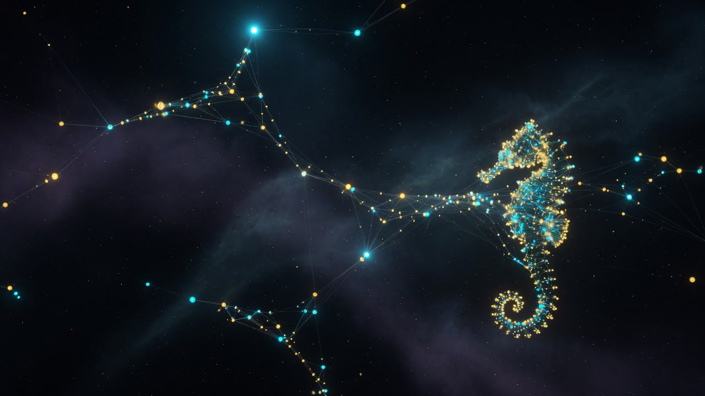

<div align="center">

#  ZOTH STUDIO `memory-whitespace`

**Sovereign Cognitive Neural Graph, Associative Synaptic Stratum & Lucy Netrunner Oracle**

[](http://127.0.0.1:8088/memory/)
[](http://127.0.0.1:8788)
[](http://127.0.0.1:8088/memory/)

<br>

<p align="center">
  
</p>

</div>

---

## 🧠 Overview

**Memory Whitespace** is the distraction-free, local-first cognitive memory graph for human operators and the Zoth 21-Agent Swarm. Modeled on biological human neurobiology, it provides an associative memory stratum where:
1. **Nodes** represent atomic memories, insights, tool evaluations, and code mutations.
2. **Edges** represent bidirectional causal associations (*"Before / Cause"* and *"After / Effect"*) with **STDP (Spike-Timing-Dependent Plasticity)** synaptic weighting.
3. **Lucy Oracle** provides a real-time 3D WebGL cyberspace visualizer and MGS-style codec terminal for inspecting memories and communicating across agent strata.

The frontend runs locally in the browser and connects over loopback Unix Domain Sockets / HTTP to the local memory daemon at `http://127.0.0.1:8788`.

---

## 📊 Cognitive Architecture & Stratum

```
┌─────────────────────────────────────────────────────────────┐
│                 ZOTH MEMORY STRATUM HIERARCHY               │
├─────────────────────────────────────────────────────────────┤
│ 1. SENSORY BUFFER   │ Volatile Working Memory (30s TTL)     │
│ 2. EPISODIC LEDGER  │ Dual-Layer Markdown Story Digests     │
│ 3. SEMANTIC STRATUM │ Lossless XML AST Grounding & Knowledge│
│ 4. CAUSAL LATTICE   │ STDP Hebbian Synaptic Weight Matrix   │
│ 5. LUCY BLACKWALL   │ 3D Netrunner Holographic Cyberspace   │
└─────────────────────────────────────────────────────────────┘
```

---

## ⚡ 1-Command Universal Agent Interface

Any autonomous agent, CLI tool, or background subagent can encode or recall memories against the loopback daemon with zero cloud dependencies:

### 1. Encode a Memory (Bash / cURL)
```bash
curl -X POST http://127.0.0.1:8788/v1/memories/encode \
  -H "Content-Type: application/json" \
  -d '{
    "agent_id": "azoth",
    "text": "Calibrated biomorphic neural lattice for Byzantine AST fuzzing",
    "category": "architecture",
    "importance": 0.95
  }'
```

### 2. Associative Recall (Python)
```python
import urllib.request
import json

payload = json.dumps({"topic": "neural", "top_k": 5}).encode("utf-8")
req = urllib.request.Request(
    "http://127.0.0.1:8788/v1/recall",
    data=payload,
    headers={"Content-Type": "application/json"}
)
with urllib.request.urlopen(req) as resp:
    result = json.loads(resp.read().decode("utf-8"))
    print("Recalled Synaptic Associations:", result)
```

---

## 🎨 Full 4-Theme Visual System

Memory Whitespace complies with `zoth-theme-system` and supports 4 synchronized themes with instant hotkey toggling (`Shift+T`):

| Theme ID | Aesthetic Archetype | Key Palette | Typography |
|:---|:---|:---|:---|
| **`dark`** (Default) | Deep Void & Cybernetic Cyan | `#00f0ff` Cyan / `#050508` Void | Syne + Figtree + IBM Plex Mono |
| **`light`** | Crisp Minimalist Editorial | `#2563eb` Cobalt / `#f7f9fc` Paper | Figtree + Inter + IBM Plex Mono |
| **`matrix`** | Phosphor Terminal Matrix Rain | `#00ff66` Phosphor / `#020d04` Void | Share Tech Mono |
| **`gold`** | Imperial Alchemical Hermetic | `#fbbf24` Amber / `#080602` Obsidian | Cinzel / Fraunces Serif |

---

## 🎮 Keyboard Controls & Lucy Cyberspace

- **`W / A / S / D`** — Move through Lucy 3D Cyberspace Memory Maze
- **`Shift`** — Sprint through memory corridors
- **`Space`** — Jump / Elevate viewpoint
- **`C`** — Dismiss / Open Codec Transmission Terminal
- **`Shift + T`** — Cycle Global Visual Themes
- **`Shift + A`** — Open On-Screen Annotator & Feedback Canvas
- **`Ctrl + K`** — Open Global Command Palette

---

## 🛡️ Sovereign Privacy Guarantees

* **Zero Cloud Rent**: The memory daemon runs 100% locally on `127.0.0.1:8788`.
* **Zero Telemetry**: No user prompts, memories, or vector embeddings are ever uploaded to cloud endpoints.
* **Lossless Export**: Export memory strata at any time to standard JSON / JSONL files.
